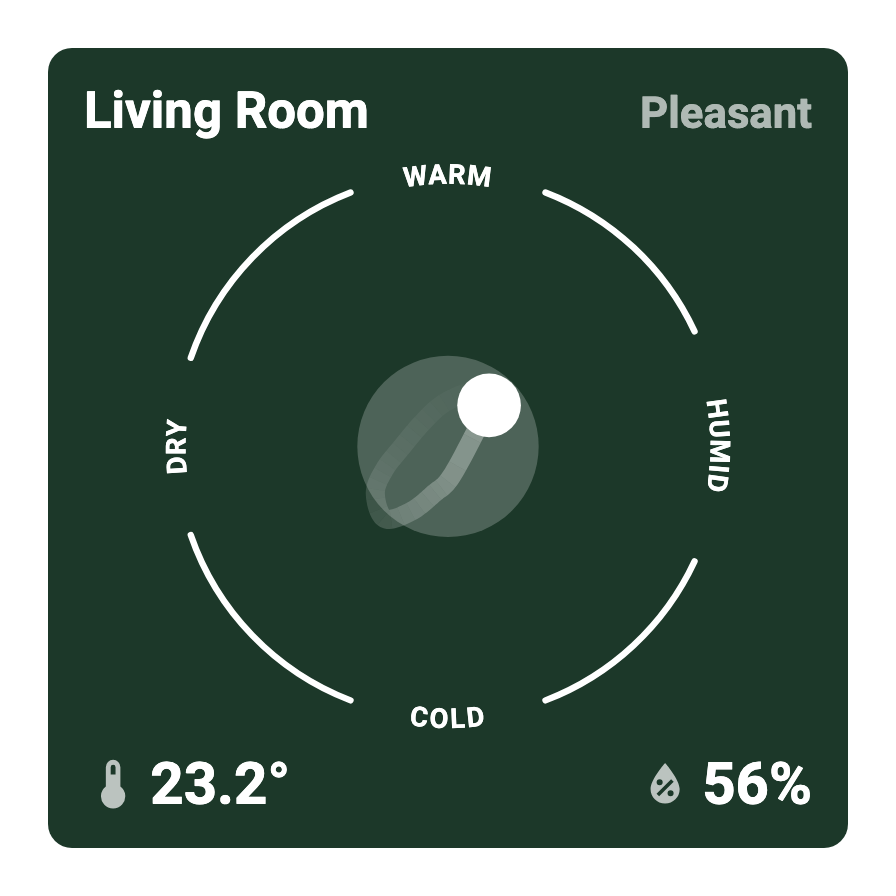
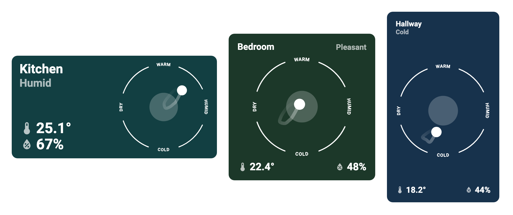
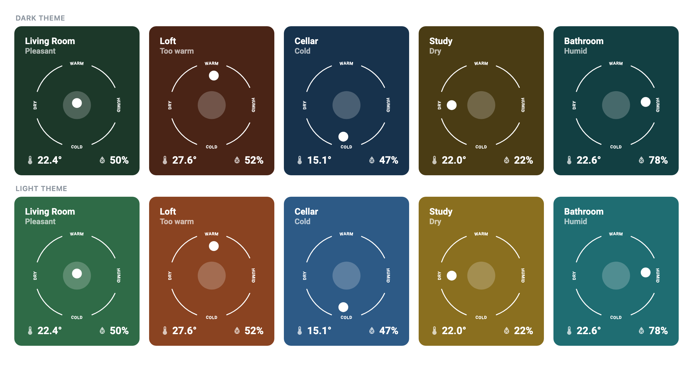

# Room Comfort Card

[![HACS Custom][hacs-badge]][hacs-url]
[![Release][release-badge]][release-url]
[![Validate][validate-badge]][validate-url]
[![License][license-badge]][license-url]

A Home Assistant dashboard card that shows a room's temperature and humidity as
a single glanceable picture, with an optional trail of where the room has been.

<p align="center">
  
</p>

The gauge plots humidity left-to-right (**DRY** → **HUMID**) and temperature
bottom-to-top (**COLD** → **WARM**). One dot therefore tells you both readings
at once: how far it sits from the middle is how far the room has drifted from
comfortable, and which way it leans tells you what to do about it.

## Features

- **Pick an area, not entities.** Choose a room and the card finds its
  temperature and humidity sensors itself. Individual entities can be picked
  manually instead.
- **Comfort state at a glance.** The card names the condition — Pleasant, Too
  warm, Cold, Dry, Humid — and repaints its background to match.
- **History trail.** Optionally trails the last few hours as a curve that fades
  out behind the current reading.
- **Three responsive layouts.** The card re-arranges itself for landscape,
  square and portrait shapes rather than squashing one layout.
- **Fully configurable in the UI.** Every option below has a control in the
  visual editor — no YAML required.
- **Light and dark themes**, with per-state colours you can override.

## Layouts

The card measures itself and picks the arrangement that fits its shape.



| Layout | When | Arrangement |
| --- | --- | --- |
| Landscape | wide and short | name and state top-left, values bottom-left, gauge right |
| Square | roughly square | name left, state right, gauge centred, values along the bottom |
| Portrait | tall or narrow | name and state stacked, gauge centred, values along the bottom |

## Comfort states

Each state has its own background colour, tuned separately for light and dark
themes so the white text stays readable (all pass WCAG AA contrast).



## Installation

### HACS (recommended)

This card is not yet in the HACS default store, so add it as a custom
repository:

1. In Home Assistant, open **HACS**.
2. Open the **⋮** menu (top right) → **Custom repositories**.
3. Enter `https://github.com/fwhitten/Comfort-Card` and choose the
   **Dashboard** category.
4. Find **Room Comfort Card** in the list and click **Download**.
5. Reload your browser.

[![Open your Home Assistant instance and open this repository inside HACS.][my-ha-badge]][my-ha-url]

### Manual

1. Download `comfort-card.js` from the [latest release][release-url].
2. Copy it to `config/www/comfort-card.js`.
3. Go to **Settings → Dashboards → ⋮ → Resources → Add resource**, with URL
   `/local/comfort-card.js` and type **JavaScript module**.
4. Reload your browser.

## Usage

Edit a dashboard, choose **Add card**, and search for **Room Comfort**.

Everything is configurable from the visual editor. The YAML below is equivalent
to the defaults, and is only needed if you prefer editing YAML directly:

```yaml
type: custom:comfort-card
area: bedroom
history_hours: 0
temp_min: 20
temp_max: 24
temp_outer_min: 16
temp_outer_max: 28
humidity_min: 40
humidity_max: 60
humidity_outer_min: 20
humidity_outer_max: 80
tap_action:
  action: more-info
```

### Options

| Option | Type | Default | Description |
| --- | --- | --- | --- |
| `type` | string | **required** | `custom:comfort-card` |
| `area` | string | — | Area to read sensors from. The card picks the first `sensor` in that area with `device_class: temperature` and the first with `device_class: humidity`. |
| `name` | string | area name | Overrides the title. |
| `manual_entities` | boolean | `false` | Choose entities directly instead of by area. |
| `temperature_entity` | string | — | Temperature sensor. Required when `manual_entities` is on; also used as a fallback if the area has no matching sensor. |
| `humidity_entity` | string | — | Humidity sensor, as above. |
| `history_hours` | number | `0` | Hours of history to trail, 0–24. `0` disables the trail. See [The history trail](#the-history-trail). |
| `temp_min` / `temp_max` | number | `20` / `24` | Comfortable temperature range — the filled inner circle. |
| `temp_outer_min` / `temp_outer_max` | number | `16` / `28` | Temperature at the edge of the gauge, used to scale the dot. |
| `humidity_min` / `humidity_max` | number | `40` / `60` | Comfortable humidity range. |
| `humidity_outer_min` / `humidity_outer_max` | number | `20` / `80` | Humidity at the edge of the gauge. |
| `colors` | object | see below | Per-state background colours, each with a `light` and `dark` value. |
| `tap_action` | action | `more-info` | Standard Home Assistant [action][actions-url]. |
| `hold_action` | action | — | Standard Home Assistant action. |

Temperature options are in whatever unit your sensors report; the card does not
convert between °C and °F.

### Colours

```yaml
colors:
  pleasant: { dark: "#1c3829", light: "#2f6b47" }
  too_warm: { dark: "#4a2416", light: "#8a4321" }
  cold:     { dark: "#17324c", light: "#2d5a86" }
  dry:      { dark: "#4a3c14", light: "#8a6f1f" }
  humid:    { dark: "#123f42", light: "#1f6d72" }
```

Card text is always white, so custom colours should stay dark enough to keep it
readable.

## How the comfort state is decided

Each reading has a **comfort** range (the filled inner circle) and a wider
**gauge** range (the ring, used only to scale the dot's position).

If both readings sit inside their comfort range, the state is **Pleasant**.
Otherwise whichever reading is furthest outside its own comfort range — measured
as a fraction of that range, so the two are compared fairly — names the state. A
room that is slightly warm but very dry therefore reads **Dry**, not **Too
warm**, because dryness is the thing worth acting on.

## The history trail

Set **Hours of history** above `0` and the card draws where the room has been,
fading to transparent at the oldest end.

> [!IMPORTANT]
> The trail needs **long-term statistics**, which means both sensors must have
> `state_class: measurement`. Most integration-provided temperature and humidity
> sensors do; some template sensors do not. Sensors without it simply show no
> trail — the rest of the card is unaffected.

Readings come from the recorder's 5-minute statistics, so the trail is already
smoothed. Samples closer together than a minimum distance are then dropped
before a spline is fitted through the rest, because sensor jitter otherwise
produces clusters of near-identical points that make the curve kink and cross
itself. The trail refreshes every 5 minutes, matching how often the statistics
update.

## Requirements

- Home Assistant with the **recorder** integration enabled (default) if you want
  the history trail.
- Resizing the card in the **sections** dashboard layout needs Home Assistant
  2024.11 or newer. On older versions the card still works and falls back to the
  masonry layout.

## Development

```bash
npm install
npm run watch   # rebuild comfort-card.js on change
```

`comfort-card.js` is committed to the repository because HACS serves it
directly, so run `npm run build` and commit the result alongside any change to
`src/`. CI fails if the two drift apart.

## License

[MIT](LICENSE)

<!-- Badges -->
[hacs-badge]: https://img.shields.io/badge/HACS-Custom-41BDF5.svg?style=flat-square
[hacs-url]: https://hacs.xyz/
[release-badge]: https://img.shields.io/github/v/release/fwhitten/Comfort-Card?style=flat-square
[release-url]: https://github.com/fwhitten/Comfort-Card/releases/latest
[validate-badge]: https://img.shields.io/github/actions/workflow/status/fwhitten/Comfort-Card/validate.yml?branch=main&label=validate&style=flat-square
[validate-url]: https://github.com/fwhitten/Comfort-Card/actions/workflows/validate.yml
[license-badge]: https://img.shields.io/github/license/fwhitten/Comfort-Card?style=flat-square
[license-url]: LICENSE
[my-ha-badge]: https://my.home-assistant.io/badges/hacs_repository.svg
[my-ha-url]: https://my.home-assistant.io/redirect/hacs_repository/?owner=fwhitten&repository=Comfort-Card&category=dashboard
[actions-url]: https://www.home-assistant.io/dashboards/actions/
